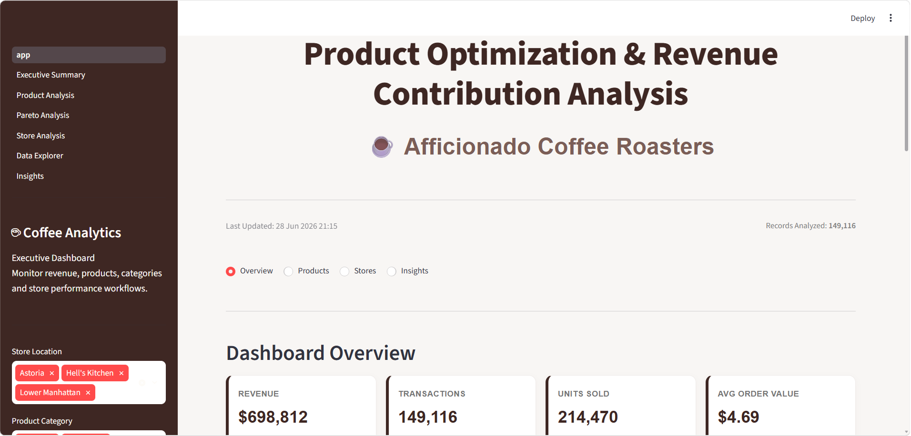
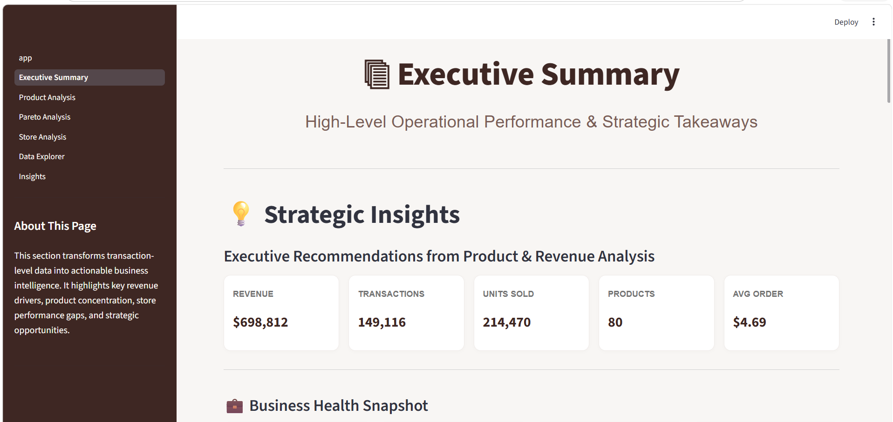
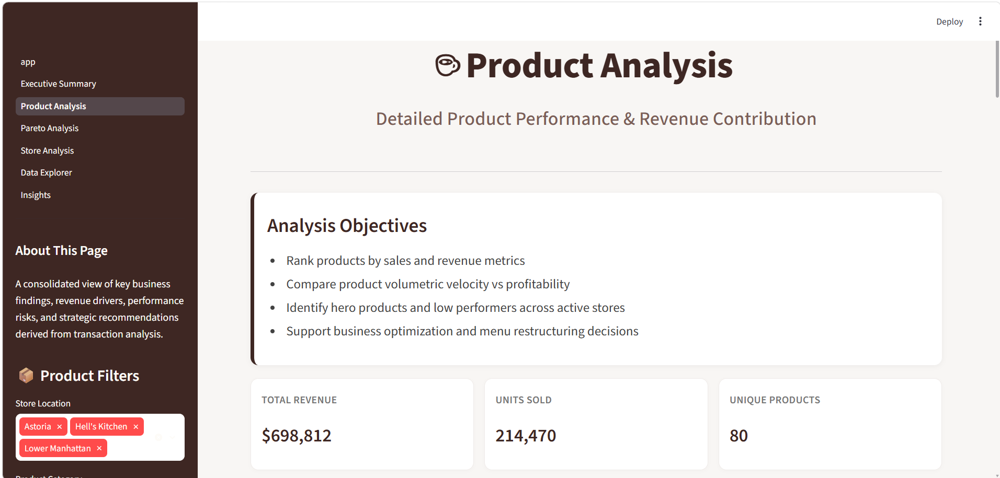
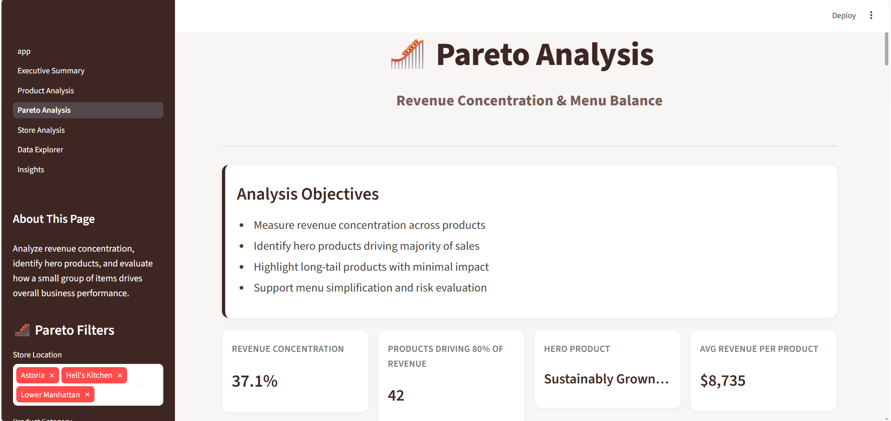
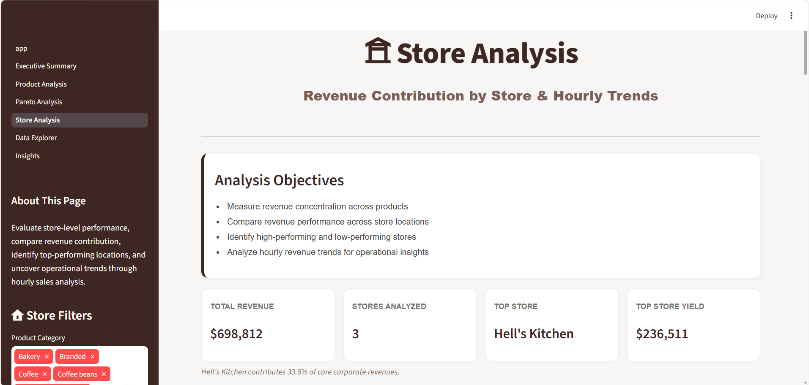
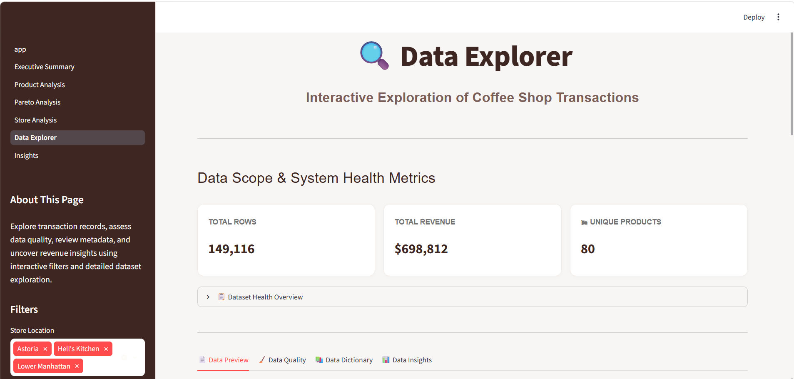
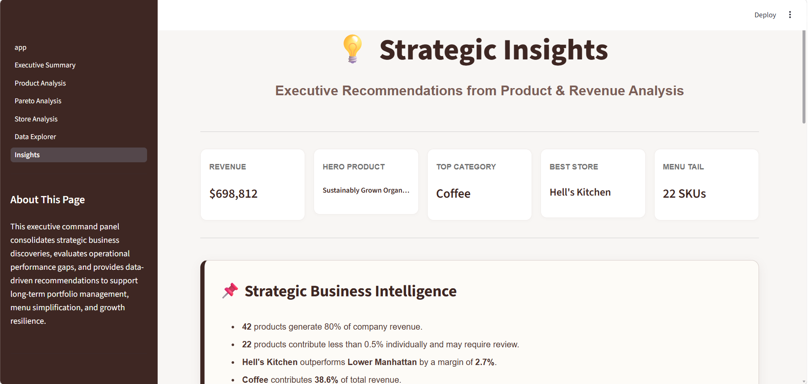

# Product Optimization & Revenue Contribution Analysis – Afficionado Coffee Roasters

[](https://coffee-retail-analytics-new.streamlit.app/)

---

## Overview

An institutional-grade, interactive Business Intelligence (BI) dashboard designed for specialty coffee retail networks (Afficionado Coffee Roasters). This software functions as a responsive Decision Support System (DSS) that processes high-density point-of-sale (POS) data to eliminate operational blind spots, streamline menu layers, and optimize floor labor schedules.

---

## Live Dashboard

**Streamlit App:** https://coffee-retail-analytics-new.streamlit.app/

---

## GitHub Repository

**Project Link:** https://github.com/keshavs3/coffee-retail-analytics
---

## Objectives

- Analyze product-level revenue contribution across menu items  
- Identify high-performing and under performing products  
- Optimize menu structure and pricing strategy  
- Improve operational decision-making using POS analytics  
- Support demand forecasting and resource planning  
- Reduce operational blind spots through data-driven insights  

---

## Dashboard Modules

- **Executive Summary –** High-level KPIs and strategic insights  
- **Revenue Analytics –** Product-wise and category-wise revenue trends  
- **Menu Performance Analysis –** Optimization of menu structure  
- **Sales Trend Analysis –** Time-series performance tracking  
- **Product Contribution –** Revenue share and ranking of items  
- **Operational Insights –** Demand patterns and efficiency signals  

---

## Key Performance Indicators (KPIs)

- Total Revenue  
- Product Contribution (%)  
- Average Order Value (AOV)  
- Top/Bottom Performing Products  
- Category-wise Revenue Share  
- Sales Volume Trends  
- Menu Efficiency Score  

---

## Key Analytical Frameworks Implemented

- **Pareto Concentration Modeling (80/20 Rule):** Isolates the vital product core driving the absolute majority of top-line returns from low-velocity, long-tail catalog drag.

- **BCG Menu Engineering Matrix:** Automatically groups menu variants into Stars, Plow Horses, Puzzles, and Dogs based on popularity (sales velocity) and unit-level gross margins.

- **Cross-Sectional Store Benchmarking:** Maps multi-unit storefront performance across critical operational indicators like Gross Receipts, Average Order Value (AOV), and Revenue per Unit.

- **Temporal Demand Analysis:** Captures hourly time-series transaction peaks to optimize staff shift scheduling and inventory allocation.

---

## Technologies Used

- Python  
- Streamlit  
- Pandas  
- NumPy  
- Plotly  
- Pathlib  
- Git & GitHub  

---

# Dashboard Preview
The dashboard transforms raw transactional data into actionable insights through advanced analytics and interactive visualizations.

## App Page
A central navigation page that provides quick access to all dashboard modules and analysis views.



---

## Executive Summary
A high-level overview of key business metrics, revenue trends, and overall performance insights.



---

## Product Analysis
Detailed breakdown of product performance, highlighting top-selling items and revenue contribution.



---

## Pareto Analysis
Identification of the 80/20 rule, showing the few products that drive the majority of revenue.



---

## Store Analysis
Comparison of store-level performance to understand location-wise sales and operational efficiency.



---

## Data Explorer
An interactive tool to filter, explore, and analyze raw dataset patterns dynamically.



---

## Insights
Key business findings and actionable insights derived from the overall data analysis.



---

## Installation

Clone the repository

```bash
git clone https://github.com/keshavs3/coffee-retail-analytics.git
```

Install dependencies

```bash
pip install -r requirements.txt
```

Run

```bash
streamlit run app.py
```

## Research Paper
This repository includes a structured research report covering:

- Data Cleaning & EDA
- Revenue Contribution Analysis
- Menu Optimization Strategy
- KPI Design & Interpretation
- Business Recommendations
- Executive Insights

## Contact

**Keshav Sinha**

**GitHub:** https://github.com/keshavs3
